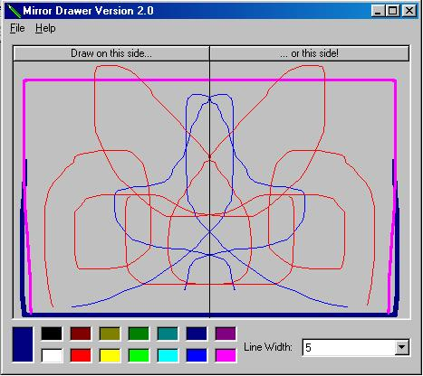



## \_\_Mirror Drawing Paint V2\_\_

### Description

This program lets you draw a mirror image with different colors or line sizez

Please vote for me if you like it ;)
 
### More Info
 

             |
---                |---
**Submitted On**   |2002-01-06 08:41:36
**By**             |[Matt Carpenter](https://github.com/Planet-Source-Code/PSCIndex/blob/master/ByAuthor/matt-carpenter.md)
**Level**          |Intermediate
**User Rating**    |4.5 (49 globes from 11 users)
**Compatibility**  |VB 6\.0
**Category**       |[Complete Applications](https://github.com/Planet-Source-Code/PSCIndex/blob/master/ByCategory/complete-applications__1-27.md)
**World**          |[Visual Basic](https://github.com/Planet-Source-Code/PSCIndex/blob/master/ByWorld/visual-basic.md)
**Archive File**   |[\_\_Mirror\_D46463152002\.zip](https://github.com/Planet-Source-Code/matt-carpenter-mirror-drawing-paint-v2__1-30428/archive/master.zip)

